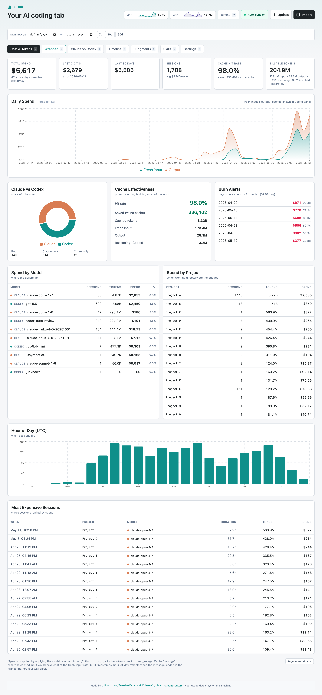
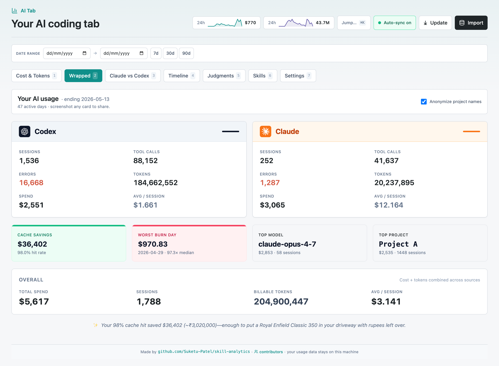
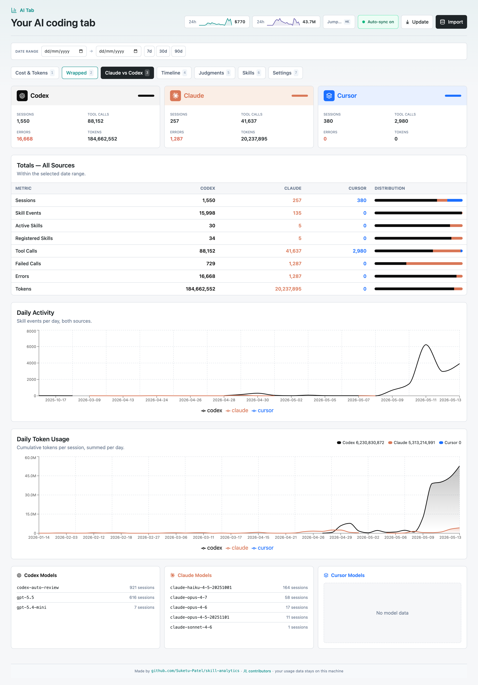

# AI Tab

Your AI coding tab, a local **Next.js dashboard** that tracks **cost, tokens, and sessions** across **Claude Code**, **Codex**, and **Cursor** by reading the JSONL/state files already on your machine. SQLite-backed, no data leaves your laptop.

The center stage is "Cost & Tokens": daily spend, model leaderboards, project breakdowns, hour-of-day patterns, burn alerts, and AI-generated reality-check facts. A shareable **Wrapped** tab pulls the highlights into a clean side-by-side card layout you can screenshot. Optional **Judgments** tab runs Haiku-as-judge over your invocations with a Codex tiebreaker.


*Cost & Tokens, daily spend, cache savings, model & project breakdowns, expensive sessions.*


*Wrapped, side-by-side Codex / Claude card with cache savings, worst burn day, top model, and a region-aware AI tidbit. Made to screenshot.*


*Three-way comparison, totals scoreboard, daily activity, daily token usage, per-source model lists.*

http://127.0.0.1:4210/

---

## Quick start

```bash
git clone https://github.com/Suketu-Patel/skill-analytics.git
cd skill-analytics
npm install
npm run import    # ingests ~/.claude/projects/ + ~/.codex/sessions/ into local SQLite
npm run dev       # http://127.0.0.1:4210
```

Requires Node >= 18 and a C++ toolchain (`better-sqlite3` builds natively, on macOS run `xcode-select --install`).

---

## What you'll see

### Cost & Tokens (default landing tab)
The new center stage. Surfaces every dimension of spend & token usage from your JSONLs:

- **Headline tiles**, total spend, last 7d / 30d, sessions, cache hit rate, total tokens (split across fresh input / cached / output / reasoning)
- **✨ Reality Check**, AI-generated 1-2 line fun facts with American comparisons (Costco chickens, NYC subway swipes, Pop-Tarts, etc.). Cached per data hash so refreshes are free. Click **↻ Regenerate** to pay Haiku a tenth of a cent for a fresh take.
- **Daily Spend**, stacked area chart: fresh input / cached input / output costs over time
- **Claude vs Codex** pie + **Cache Effectiveness** panel + **Burn Alerts** (days where spend exceeded 3× your median)
- **Spend by Model** and **Spend by Project (cwd)** leaderboards
- **Hour of Day** + **Day of Week** charts, when do you actually use these tools?
- **Most Expensive Sessions** table, single sessions ranked by spend

### Other tabs
- **Claude vs Codex**, side-by-side totals + daily charts
- **Timeline**, daily skill events / errors / token usage
- **Judgments**, LLM-as-judge (Haiku) ratings, with codex 2nd-opinion tiebreaker
- **Skill Overview / Skill Health / Errors / Pricing**, the original skill-centric views (kept for reference)

All time-series charts support **click-and-drag horizontal date selection** to filter every panel by date range.

---

## Auto-sync (new in v2)

The dashboard imports new transcripts automatically every **30 minutes** while the browser tab is open. The header shows a `Synced X ago` chip that you can click to disable. The auto-sync skips when:
- A manual Import is already in flight
- The browser tab is hidden (saves CPU while in the background)

---

## In-app updates (new in v2)

A **⤓ Update** button in the header runs `git pull --ff-only` + `npm install` (if deps changed) without leaving the dashboard. It refuses to pull on a dirty working tree to avoid clobbering your changes. Useful when new versions ship, no need to drop back to the terminal for updates.

---

## Optional features

These need additional CLIs on PATH but the dashboard works without them:

- **Haiku judge** (`⚖ Run Haiku judge` in the Judgments tab), needs the `claude` CLI. Sweeps unjudged invocations, ~$0.001 each.
- **Codex 2nd opinion** (`⚖⚖ Run Codex 2nd opinion`), needs the `codex` CLI. Tiebreaks where Haiku and the user's next-turn behavior disagree.
- **Reality Check (fun facts)**, needs the `claude` CLI. Calls Haiku once per unique data snapshot.

---

## Data

- SQLite DB at `data/skill-analytics.sqlite` (gitignored; never leaves your machine).
- Importer reads only your local `~/.claude/projects/**/*.jsonl` and `~/.codex/sessions/**/*.jsonl` plus `~/.codex/log/codex-tui.log` and any `.codex/agents/*.toml`. Nothing is uploaded anywhere.
- Re-run `npm run import` anytime to refresh. Idempotent, re-imports are safe.

---

## Install prompt (paste into any agent)

```
Install skill-analytics on this machine by following the Install steps in https://github.com/Suketu-Patel/skill-analytics/blob/main/README.md, then report the URL.
```

## Update prompt (paste into any agent)

```
Update my skill-analytics install by following the Update steps in https://github.com/Suketu-Patel/skill-analytics/blob/main/README.md, then report what's new.
```

---

## Install steps

Stack: Next.js 15 + React 19 + SQLite (better-sqlite3) + Tailwind. Port: 4210.

1. **Verify prerequisites.** `node --version` (need >= 18), `npm --version`, `python3 --version`. better-sqlite3 needs native build tools (macOS: `xcode-select --install`, Linux: `build-essential`). Stop and report anything missing.
2. **Clone into `~/Desktop/skill-analytics/`.** Ask before overwriting if it exists. `git clone https://github.com/Suketu-Patel/skill-analytics.git ~/Desktop/skill-analytics`.
3. **Install deps.** `cd ~/Desktop/skill-analytics && npm install` (expect ~30s + a native compile).
4. **Personalize data.** `npm run import` scans the local user's `~/.claude/projects/**/*.jsonl` and `~/.codex/sessions/**/*.jsonl` into `data/skill-analytics.sqlite`. Nothing from the original author ships in the repo.
5. **Start the dev server in the background.** `npm run dev` with `run_in_background: true`. Wait for "Ready in" or HTTP 200 at `http://127.0.0.1:4210/` (max 30s).
6. **Verify.** `curl http://127.0.0.1:4210/api/metrics/cost-overview` returns `{"ok":true, ... "headline": ...}`.
7. **Report.** URL, totals from the headline, how to stop (Ctrl-C). Mention auto-sync (30 min) + the ⤓ Update button. Optional: `claude` CLI for Reality Check + Haiku judge, `codex` CLI for the tiebreaker.

Read + run only. Don't commit, push, or modify files in the clone.

---

## Update steps

1. **cd into the existing clone** at `~/Desktop/skill-analytics` (ask if it's elsewhere).
2. **Working tree clean?** `git status --porcelain`, if dirty, stop and ask. Don't auto-stash.
3. **Stop the running dev server.** `pkill -f "next dev.*4210"` (don't error if nothing matched).
4. **Pull latest.** `git pull --ff-only origin main`. If git complains about divergence, stop.
5. **Reinstall deps.** `npm install --no-audit --no-fund`. If Node ABI changed: `npm rebuild better-sqlite3`.
6. **Re-import.** `npm run import` applies schema migrations + picks up new transcripts.
7. **Restart server in background.** `npm run dev` with `run_in_background: true`. Wait for HTTP 200 at `http://127.0.0.1:4210/`.
8. **Verify.** `curl http://127.0.0.1:4210/api/metrics/cost-overview` returns `{"ok":true,"headline":{...}}`.
9. **Report what's new since their version.** Skim the latest commits with `git log --oneline -20` and summarize.

Don't delete the SQLite DB. Migrations are idempotent, judgments + import history are preserved.

---

## Explicit skill events

If a skill or agent can reliably announce its own lifecycle, write explicit events to `~/.codex/skill-analytics/events.jsonl`:

```bash
npm run skill-event -- start   --skill my-skill --notes "starting"
npm run skill-event -- success --skill my-skill --notes "done"
npm run skill-event -- error   --skill my-skill --category validation --notes "..."
npm run import
```

The dashboard separates explicit events from inferred mentions so historical data stays useful without overstating confidence.

---

## License

MIT.
